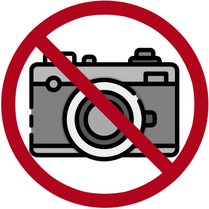

##  Deshabilitar camara
<!-- shileds -->

 En este repositorio se guarda una app android que limita el uso de la camara en el dispositivo.

### Idiomas soportados

App icon made by Freepik from www.flaticon.com, edit by [Alex Gracia](https://github.com/AlexGracia).
