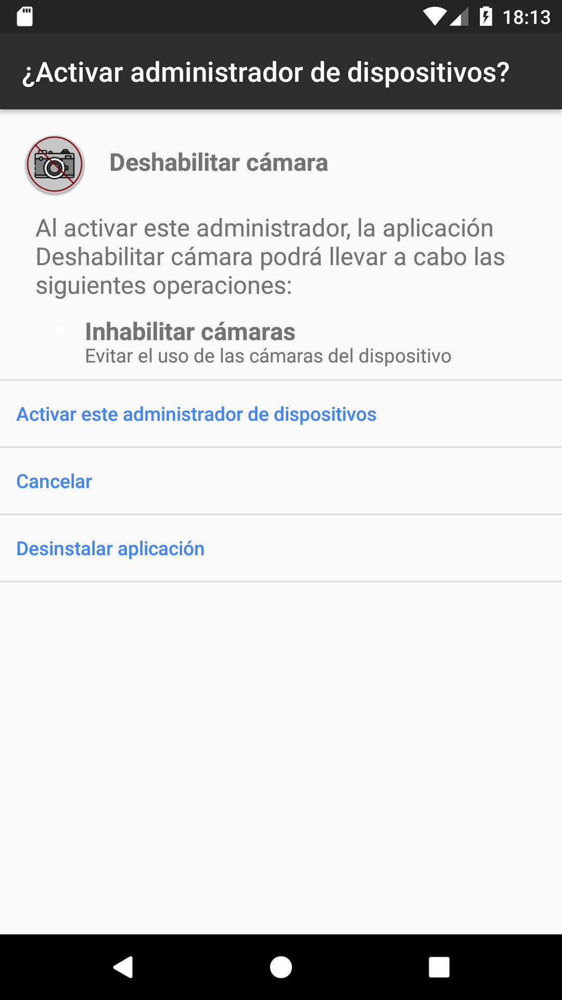

#  Deshabilitar-camara
<!-- Botones -->

 En este repositorio se guarda una app android que limita el uso de la camara en el dispositivo.

## Idiomas soportados
      

## Capturas de pantalla
   

 Icono de la aplicacion creado por Freepik desde www.flaticon.com, editado por [Alex Gracia](https://github.com/AlexGracia).
 Traducido con [Google Translate](https://translate.google.com/).
